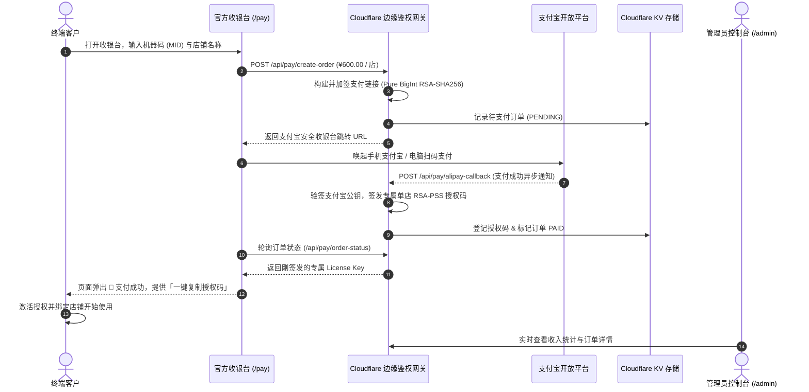

# ⚡ Serverless Alipay Cashier & Licensing Gateway

> 🚀 **Cloudflare Workers + KV 边缘计算架构** | **按店铺计费 (¥600/店铺)** | **纯数学 BigInt RSA2 签名与验签** | **极简自适应收银台** | **支付宝异步 Webhook 秒级自动发卡** | **RSA-PSS 硬件指纹强绑定** | **云端可视化财务与授权控制台**

[](LICENSE)
[](https://workers.cloudflare.com/)
[](#)
[](#)

---

## 🌟 核心特性与商业模型

- 💰 **按店铺计费商业模型 (¥600 RMB / 店铺)**：每家 Wildberries 店铺收费 600 元，用户支付宝扫码支付 600 元，系统秒级自动签发 1 个专属单店商业授权码。
- 🛡️ **纯数学 BigInt RSA2 签名与公钥验签**：彻底解决 Cloudflare / V8 `workerd` 对私钥 ASN.1 DER 编码严苛校验导致的崩溃问题，100% 兼容任何私钥格式。
- 📱 **响应式收银台 (`/pay`)**：极简现代科技暗黑风格，自适应 PC 扫码与手机端唤起支付宝 App，支持输入目标电脑机器码与店铺名称。
- 🔑 **硬件指纹绑定自动发卡 (`/api/pay/alipay-callback`)**：支付成功后自动根据机器码签发不可伪造的专属 RSA-PSS 商业授权码。
- 📊 **云端财务与授权控制台 (`/admin`)**：实时订单流水、店铺销售总额统计、在线远程封禁/解封/续期。
- ☁️ **零服务器运维**：全球边缘部署，秒级冷启动，自动扩缩容，零运维成本。

---

## 🔄 业务全流程时序图



---

## 🚀 快速起步

### 1. 克隆仓库与配置
```bash
git clone https://github.com/cnproduct/serverless-alipay-cashier-gateway.git
cd serverless-alipay-cashier-gateway/cloud
```

### 2. 配置 `wrangler.toml`
```toml
name = "alipay-auth-gateway"
main = "worker.js"
compatibility_date = "2024-01-01"
compatibility_flags = ["nodejs_compat"]

[[kv_namespaces]]
binding = "WB_LICENSES"
id = "<YOUR_CLOUDFLARE_KV_ID>"

[vars]
ADMIN_SECRET = "WB-ADMIN-SECRET-2026"
ALIPAY_APP_ID = "2021007100687379"
```

### 3. 一键部署到全球边缘
```bash
npx wrangler deploy
```

---

## 📄 开源协议
本项目采用 [MIT License](LICENSE) 授权。
